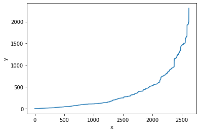

```python
import struct
import random
import os
import numpy as np
import pandas as pd 
import argparse
import logging
import sys
import operator
from hashlib import md5
from reedsolo import RSCodec
from math import ceil
from math import log, floor, sqrt
import random
import json
import numpy as np
from numpy.random import RandomState
import scipy.interpolate as inter
import math
from Fountain_Helpers import *
from Visual import * 
from FT_class import *
#logging.getLogger().setLevel(logging.DEBUG)
```


```python
%load_ext autoreload
%autoreload 2
```

    The autoreload extension is already loaded. To reload it, use:
      %reload_ext autoreload


## preprocessing


```python
#----------------------------------------run this block if your input is ATGC--------------------------------------#
file_name = 'dna.txt'
chunk_size = 32

table = []
try:
  f = open(file_name, 'r')
except: 
  logging.error("%s file not found", file_name)
  sys.exit(0)
dna = f.read()
dna = ''.join(dna.split('\n'))
data = dna_to_int_array(dna)
data = bytes(data)
original_size = len(data)
bd = byte_to_dna(data)
print(dna[0:30])
print(bd[0:30])
file_compare(bd,dna)
```

    AACAAACCCAACCAAAGTGTGTCATCAGGA
    AACAAACCCAACCAAAGTGTGTCATCAGGA
    all the same


```python
#----------------------------------------run this block if your input is bin file--------------------------------------#
# file name and chunk_size here
file_name = 'lena.jpg'
chunk_size = 32

#for print info table
table = []
#read file
try:
  f = open(file_name, 'rb')
except: 
  logging.error("%s file not found", file_name)
  sys.exit(0)
data = f.read()    
original_size = os.path.getsize(file_name)
```


```python
#perprocessing
#data: bytes data read from a file, paddied after zero padding 
#size: how many bytes after padding
#f_in: chunks of data, can be used directly in LT code
#chunk_size: how many bytes in one chunk
#f_size: how many chunks 
#zero padding
pad = -len(data) % chunk_size
if pad > 0:
  logging.debug("Padded the file with %d zero to have a round number of blocks of data", pad)    
data += b'\0' * pad #zero padding.
size = len(data)

#divide into chunks
chunk_num = int(size/chunk_size)
data_array = [None]*chunk_num
table.append(["file name",file_name])
table.append(["original size", original_size])
table.append(["file size", size])
table.append(["padding",pad])
table.append(["chunk size",chunk_size])
table.append(["chunk_num",chunk_num])
table.append(["head data",data[:9]])

# print("processing...")
for num in range(chunk_num):
    start = chunk_size * num
    end = chunk_size * (num+1)
    chunk_binary = data[start:end]
    data_array[num] = chunk_binary
   # return (data_array, len(data))
f_in = data_array
f_size = len(data)
# print("file preprocessed")
simpleTable(table)
```

<table border="1" class="dataframe">
  <thead>
    <tr style="text-align: right;">
      <th></th>
      <th>property</th>
      <th>value</th>
    </tr>
  </thead>
  <tbody>
    <tr>
      <th>0</th>
      <td>file name</td>
      <td>dna.txt</td>
    </tr>
    <tr>
      <th>1</th>
      <td>original size</td>
      <td>73800</td>
    </tr>
    <tr>
      <th>2</th>
      <td>file size</td>
      <td>73824</td>
    </tr>
    <tr>
      <th>3</th>
      <td>padding</td>
      <td>24</td>
    </tr>
    <tr>
      <th>4</th>
      <td>chunk size</td>
      <td>32</td>
    </tr>
    <tr>
      <th>5</th>
      <td>chunk_num</td>
      <td>2307</td>
    </tr>
    <tr>
      <th>6</th>
      <td>head data</td>
      <td>b'\x04\x05A@\xbb\xb4\xd2\x8e\x9c'</td>
    </tr>
  </tbody>
</table>
## encode


```python
table = []
alp = 2.0 
f = DNAFountain(file_in = f_in, 
                    file_size = f_size, 
                    chunk_size = chunk_size, 
                    alpha = alp
                    )
table.append(['chunk_num',chunk_num])
table.append(['alpha',alp])
```


```python
#@title run FT to generate alp ones 
out_file_name = 'dna.txt' #@param
out = open(out_file_name, 'w')
time = 0
succ = 0
while f.good < f.final:
    d = f.droplet()
    time += 1
    if f.screen(d):
        out.write("{}\n".format(d.to_human_readable_DNA()))
        succ += 1
    if time%1000 == 0:
        print("%d tries, %d succ",time,succ)
out.close()
print("Finished. Generated",f.good," packets out of", f.tries,"tries",(f.good+0.0)/f.tries)
print(succ/time)
table.append(['time',time])
table.append(['droplet num',succ])
table.append(['succ rate',succ/time])
table.append(['out file name',out_file_name])
simpleTable(table)
```

    %d tries, %d succ 44000 6656
    %d tries, %d succ 45000 6807
    Finished. Generated 6922  packets out of 45784 tries 0.15118818801327974
    0.15118818801327974

<table border="1" class="dataframe">
  <thead>
    <tr style="text-align: right;">
      <th></th>
      <th>property</th>
      <th>value</th>
    </tr>
  </thead>
  <tbody>
    <tr>
      <th>0</th>
      <td>chunk_num</td>
      <td>2307</td>
    </tr>
    <tr>
      <th>1</th>
      <td>alpha</td>
      <td>2</td>
    </tr>
    <tr>
      <th>2</th>
      <td>time</td>
      <td>45784</td>
    </tr>
    <tr>
      <th>3</th>
      <td>droplet num</td>
      <td>6922</td>
    </tr>
    <tr>
      <th>4</th>
      <td>succ rate</td>
      <td>0.151188</td>
    </tr>
    <tr>
      <th>5</th>
      <td>out file name</td>
      <td>dna.txt</td>
    </tr>
  </tbody>
</table>


```python
# dataframe and save to csv
df = f.df()
df.to_csv('dna.csv')
df.head()
```


<table border="1" class="dataframe">
  <thead>
    <tr style="text-align: right;">
      <th></th>
      <th>dna</th>
      <th>gc</th>
      <th>degree</th>
      <th>chunk_nums</th>
    </tr>
  </thead>
  <tbody>
    <tr>
      <th>0</th>
      <td>AACAAACCCAACCAAAGTGTGTCATCAGGATGGCTATTAAACCATC...</td>
      <td>0.451389</td>
      <td>2</td>
      <td>136 667</td>
    </tr>
    <tr>
      <th>1</th>
      <td>AAGAAAGGGAAGGAAAGCAAGTCTACACCAAACTATGTGAGGTTAT...</td>
      <td>0.479167</td>
      <td>1</td>
      <td>275</td>
    </tr>
    <tr>
      <th>2</th>
      <td>GGGAAGGACGAGGAAAGTCCATGAAAGGCCGTTCCCGTATATATTG...</td>
      <td>0.479167</td>
      <td>2</td>
      <td>218 443</td>
    </tr>
    <tr>
      <th>3</th>
      <td>GGAAGGACGAGTGAGGAGAGCAAAGCCAACTTACTATTCACAAAGG...</td>
      <td>0.500000</td>
      <td>11</td>
      <td>97 385 233 172 496 145 626 180 565 150 601</td>
    </tr>
    <tr>
      <th>4</th>
      <td>ACCAATACCTTGAACAGCCTCTGAACGATACGCTCTTGGCGTCTCC...</td>
      <td>0.500000</td>
      <td>3</td>
      <td>448 618 373</td>
    </tr>
  </tbody>
</table>


## decode


```python
file_name = 'dna.txt'
g = Glass(chunk_num,out_file_name)

def decode():    
    #@title decode
    logging.getLogger().setLevel(logging.INFO)
    f = open(out_file_name,'r')
    
    x = []
    y = []
    line = 0
    errors = 0
    seen_seeds = defaultdict(int)
    
    while True:
        #read one dna in dna 
        try:     
            dna = f.readline().rstrip('\n')
        except:
            logging.info("Finished reading input file!")
            break
        if len(dna) == 0:
            logging.info("Finished reading input file!")
            break
        
        line += 1
        seed, data = g.add_dna(dna)
        
        if seed == -1: #reed-solomon error!
            errors += 1
            print('seed error!',line)
        else:
            seen_seeds[seed] += 1       

        if line % 100 == 0:
            logging.info("After reading %d lines, %d chunks are done. So far: %d rejections (%f) %d barcodes", line, g.chunksDone(), errors, errors/(line+0.0), g.len_seen_seed())
            pass
        x.append(line)
        y.append(g.chunksDone())

        if g.isDone():
            logging.info("After reading %d lines, %d chunks are done. So far: %d rejections (%f) %d barcodes", line, g.chunksDone(), errors, errors/(line+0.0), g.len_seen_seed())
            logging.info("Done!")
            f.close()
            line_plot(x,y)
            return line
        
decode()
```

    INFO:root:After reading 2600 lines, 1928 chunks are done. So far: 0 rejections (0.000000) 2600 barcodes
    INFO:root:After reading 2619 lines, 2307 chunks are done. So far: 0 rejections (0.000000) 2619 barcodes
    INFO:root:Done!





```python
#---------------------------------------------------------bin file-------------------------------------------#
g.Save('out.jpg')
```

    INFO:root:saved


```python
#--------------------------------------------------------text------------------------------------------------#
outstring = g.String()
print(outstring)
len(outstring)
```


```python
#--------------------------------------------------------ATGC------------------------------------------------#
re_dna = g.reDNA()
print('dna: ', dna[:50])
print('re_dna: ',re_dna[:50])
file_compare(dna,re_dna)
```

    dna:  AACAAACCCAACCAAAGTGTGTCATCAGGATGGCTATTAAACCATCCCAT
    re_dna:  AACAAACCCAACCAAAGTGTGTCATCAGGATGGCTATTAAACCATCCCAT
    all the same


