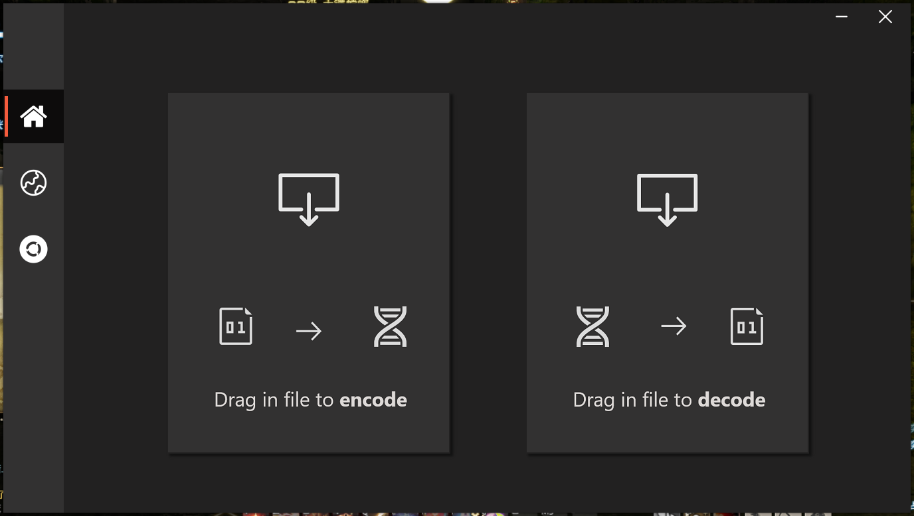
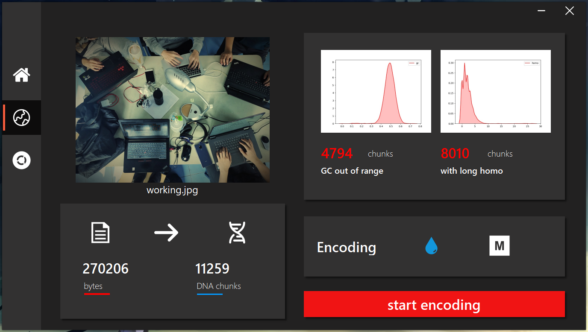
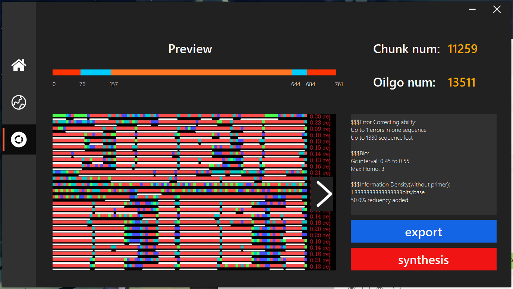
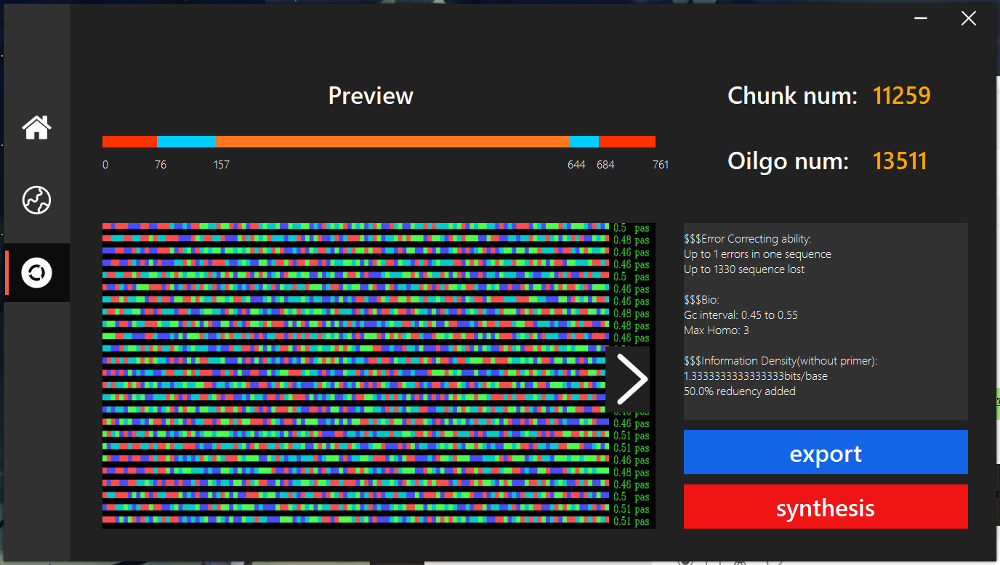

# Software README

* Start Page

## Image processing

Image is loaded on top-left (If files with other format is loaded, it will be shown in icon). Below the image shows the size of the original file and corresponding DNA chunks (redundancy not added). Plots on top-right are the number of chunks with unacceptable GC rate and the number of chunks with long homopolymers (sequences that contain repeated base like CGAAAAAT), respectively. The two buttons below are for selecting encode algorithms, 'drop' uses DNA fountain, 'M' uses mask encoding.

Click the Start Encoding button, and the problem will be solved. 

## Result Illustration

Two plots with colored blocks will be generated, you can switch between them by clicking the arrow.

The first one is the result produced without any encoding algorithm, which in other words is just 2 to 4 base conversion. Each color stands for one kind of base. The long homopolymers are underlined in white, we can tell from the result that when the original file contains too many repeated fragments, the converted file will not be usable for synthesis. Same conclusion can be drawn from the stats on the right.

The second plot shows the encoding result using either DNA fountain or mask. We can see that there is no more long homopolymers, and the fraction of each base seem uniform. Statistics on the right tells the error rate, GC rate interval and storage efficiency of the result. The two buttons on the bottom-right are for exporting and saving the generated file.

